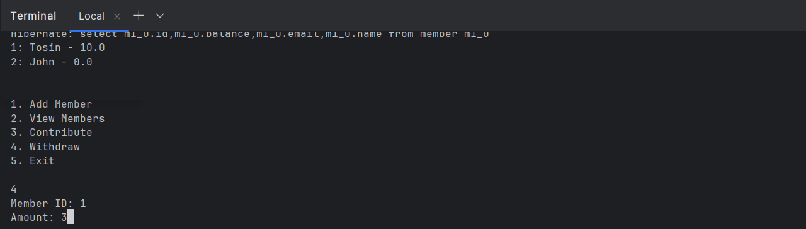

# Cooperative App
A console-based cooperative/thrift association management system built with Java, Spring Boot, and Maven 
to manage the financial activities of a coopertaive/thrift association. This system will handle member accounts, contributions, withdrawals, and basic financial reporting, with specific validation rules to ensure secure and responsible transactions.

## Features
- Member registration with email uniqueness validation
- Record and manage member contributions
- In-memory H2 database for easy setup
- Console-based interaction (no web interface)

## Folder Structure
<pre>
    <strong>cooperative-app/</strong> 
        ├── <strong>src/</strong> 
        │ ├── <strong>main/</strong> 
        │ │ ├── <strong>java/</strong> 
        │ │ │ └── <strong>com/</strong> 
        │ │ │ └── <strong>cooperative/</strong> 
        │ │ │ ├── CooperativeAppApplication.java 
        │ │ │ ├── <strong>console/</strong> 
        ├ | | |── ConsoleApp.java 
        │ │ │ ├── <strong>model/</strong> 
        │ │ │ │ ├── Member.java 
        │ │ │ │ └── Contribution.java 
        │ │ │ │ └── Withdrawal.java 
        │ │ │ ├── <strong>repository/</strong> 
        │ │ │ │ └── MemberRepository.java 
        │ │ │ │ └── ContributionRepository.java 
        │ │ │ │ └── WithdrawalRepository.java 
        │ │ │ └── <strong>service/</strong> 
        │ │ │ └── MemberService.java 
        │ │ │ └── ContributionService.java 
        │ │ │ └── WithdrawalService.java 
        │ │ └── <strong>resources/</strong> 
        │ │ └── application.properties 
        │ └── test/ 
        │ └── java/ 
        │ └── com/ 
        │ └── cooperative/ 
        │ └── (test files) 
        ├── pom.xml 
        └── README.md
</pre>
## Prerequisites
- Java 17 or higher
- Maven 3.8+

## Installation

1. **Clone the repository:**
```bash 
   git clone https://github.com/tosmel2/cooperative-app.git 
   cd cooperative-app
```

2. **Install dependencies:**
```mvn clean install```

## Running the Application
You can run the application from the terminal using Maven:
```mvn spring-boot:run```

Or, build the JAR and run it:
```mvn clean package java -jar target/cooperative-app-0.0.1-SNAPSHOT.jar```

## Usage
- The application will prompt you in the terminal for actions such as registering members and recording contributions.
- All data is stored in an in-memory H2 database and will be lost when the application stops.

## Configuration
You can adjust settings in `src/main/resources/application.properties` as needed (e.g., database settings).

## Deliverables
- <strong>Start App Output in Console</strongs><br>  
  

- <strong>App running in Console</strongs><br>  
  

- <strong>Add Members</strongs><br>  
  
  
- <strong>View Members</strongs><br>  
  

- <strong>Member Contribute By ID</strongs><br>  
  

- <strong>View Contributed Members</strongs><br>  
  

- <strong>Member Withdraw By ID</strongs><br>  
  

- <strong>After Successful Withdraw and Balance Output in Console</strongs><br>  
  

## Author
Tosin Adewale
adewaletosin0808@gmail.com