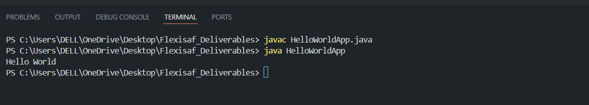

# Hands-on: Tools Setup for Java Development

## Setup Instructions

- Install a JRE and JDK.
- Install an IDE such as IntelliJ IDEA or Visual Studio Code.
- Compile a Java source file from the command line.
- Run a Java program from the command line.
- Use an IDE to compile and run Java code.

### Resources

- [Official Oracle Guide: Hello World using Java](https://docs.oracle.com/javase/tutorial/getStarted/cupojava/win32.html)

## Task

Write a "Hello World App" program using your IDE of choice.  
Run your program and confirm that **"Hello World"** is displayed in the console.

## Features

- Hello World Output in Console  
  
