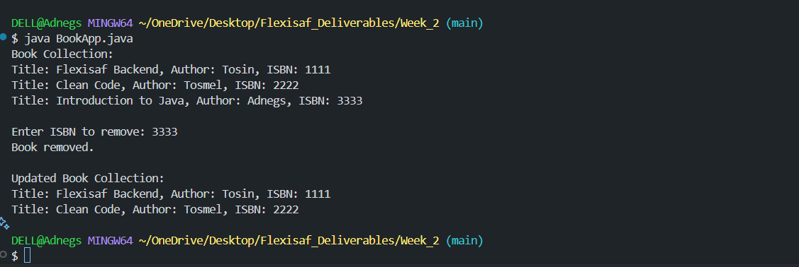

# Hands-on: Object-Oriented Programming Concepts

Concepts of objects, classes. inheritance, packages

## Deliverables

Write a Java program to create a class called "Book" with attributes for title, author, and ISBN, and methods to add and remove books from a collection

### Resources

- [Object-Oriented Programming Concepts](https://docs.oracle.com/javase/tutorial/java/concepts/index.html)

## Features

- Add/Remove books from a collections Console  
  
