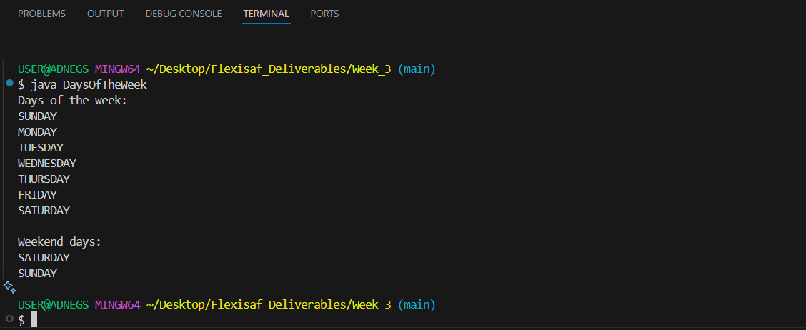

# Hands-on: Java Language Basics | Coding Classes and Objects

### Task A
Variables, Operators, Expressions, Statement, blocks, control flow statements

### Task B
Creating classes, object instantiation, method and variable access, nested and inner class devlaration and instantiation, access control, enums

## Deliverables
Create a program that displays days of the week using an enum to capture the days. Use a super and a sub class in your program.

### Resources

- [Creating Variable/field and if else statement with Java](https://docs.oracle.com/javase/tutorial/java/nutsandbolts/index.html)

- [Creating classes object instantiation method and variable access in Java](https://docs.oracle.com/javase/tutorial/java/javaOO/index.html)

## Features

- Add/Remove books from a collections Console  
  
