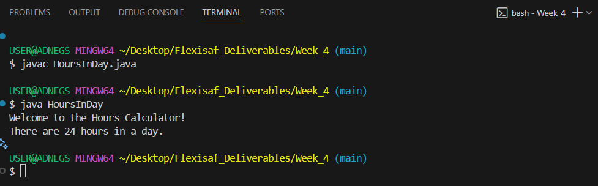

# Hands-on: Java Language |  Coding Interfaces

### Task
Defining interface, implementing interface and using an interface type, extending an interface, default methods in interface.

## Deliverables
Write a program that calculate hours in a day. Your program should use an interface with two methods and your class should implement the interface.

### Resources
- [Java Interface](https://docs.oracle.com/javase/tutorial/java/IandI/index.html)

## Features
- Hours in a Day  
  
