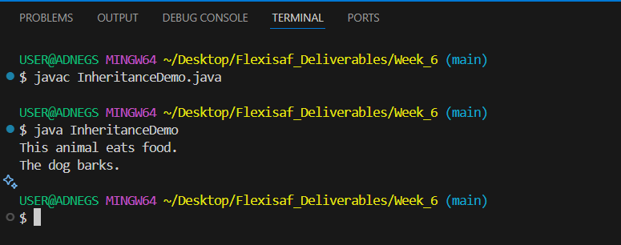
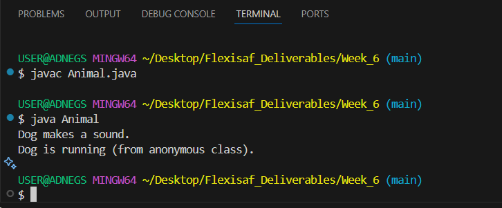

# Hands-on: Java Language ==>  Implementing Inheritance

## Task
Types of methods, overriding and hiding methods, hiding of fields (encapsulation), polymorphism, using keywords 'super' and 'this', final classes and methods, abstract classes and methods.

## Deliverables
Write a program that demonstrate your knowledge of nested classes, access modifier, anonymous classes.

### Resources
- [Implementing Inheritance](https://docs.oracle.com/javase/tutorial/java/javaOO/more.html)

## Features
- Implementing Inheritance  
  

  - Demonstrate Nested Classes  
  
