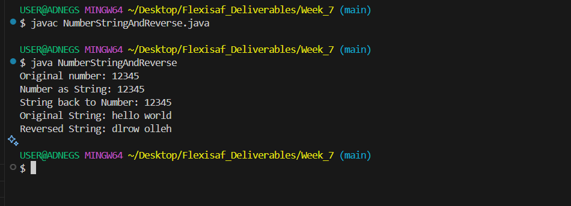

# Hands-on: Java Language ==>  Working with Strings and Numbers

## Task
The number classes, formatting number ouputs, static constants and methods in the java.lang.Math class, Characters and the Character cass, conversions between numbers and strings, String manipulation, autoboxing and unboxing.

## Deliverables
Write a program that convert the Numbers to Strings and back to Numbers. Write a program that reverse a String. Example takes in "hello world" and return "dlrow olleh"

### Resources
- [Implementing Inheritance](https://docs.oracle.com/javase/tutorial/java/data/index.html)

## Features
- Numbers and Strings  
  

  