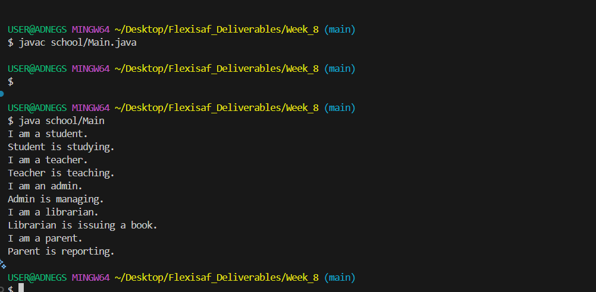

# Hands-on: Java Language ==>  Working with Packages

## Task
Creating and using packages, naming packages, managing source and class files.

## Deliverables
Write a package with 5 classes and 5 interfaces and 3 abstract classes. Each class must have a minimum two fields with their getter and setters. Interface should have minimum of 3 methods

### Resources
- [Working with Packages](https://docs.oracle.com/javase/tutorial/java/package/index.html)

## Features
- Packages  
  
