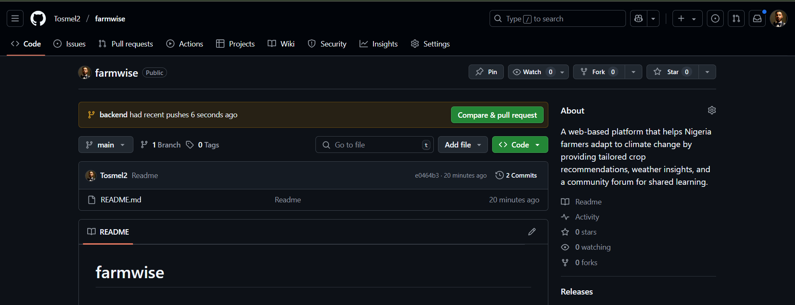

# Hands-on: Java Language ==>  Version control (Git)

## Task
Creating repositories, cloning repositories,creating branches, committing and reverting commits, pulling and pushing changes downstream and upstream, fetching, merging and  renaming branches, creating, reviewing merging, reverting pull requees etc.

## Deliverables
Create a repository, clone it to local machine, create a branch, make changes, make a commmit, push to remote repository, send a pull request, merge pull request.

### Resources
- [Git Commands](https://www.loginradius.com/blog/engineering/git-commands)

## Useful Git Commands List
| Command | Description |
|--------|-------------|
| `git init` | Initialize a local Git repository |
| `git clone repo_url` | Clone public repository |
| `git clone ssh://git@github.com/[username]/[repository-name].git` | Clone private repository |
| `git status` | Check status |
| `git add [file-name]` | Add a file to the staging area |
| `git add -A` | Add all new and changed files to the staging area |
| `git commit -m "[commit message]"` | Commit changes |
| `git rm -r [file-name.txt]` | Remove a file (or folder) |
| `git branch` | List of branches (asterisk denotes current) |
| `git branch -a` | List all branches (local and remote) |
| `git branch [branch name]` | Create a new branch |
| `git branch -d [branch name]` | Delete a branch |
| `git branch -D [branch name]` | Delete a branch forcefully |
| `git push origin --delete [branch name]` | Delete a remote branch |
| `git checkout -b [branch name]` | Create a new branch and switch to it |
| `git checkout -b [branch name] origin/[branch name]` | Clone a remote branch and switch |
| `git branch -m [old] [new]` | Rename a local branch |
| `git checkout [branch name]` | Switch to a branch |
| `git checkout -` | Switch to the last checked out branch |
| `git checkout -- [file-name.txt]` | Discard changes to a file |
| `git merge [branch name]` | Merge a branch into the active branch |
| `git merge [source] [target]` | Merge a branch into a target branch |
| `git stash` | Stash changes in a dirty working directory |
| `git stash clear` | Remove all stashed entries |
| `git push origin [branch name]` | Push a branch to remote repository |
| `git push -u origin [branch name]` | Push and track remote branch |
| `git push` | Push changes to remembered branch |
| `git pull` | Update local repo to newest commit |
| `git pull origin [branch name]` | Pull changes from remote branch |
| `git remote add origin ssh://...` | Add a remote repository |
| `git remote set-url origin ssh://...` | Set repo origin to SSH |
| `git log` | View commit history |
| `git log --summary` | View detailed commit history |
| `git log --oneline` | View brief commit history |
| `git diff [source] [target]` | Preview changes before merging |
| `git revert [commit id]` | Revert commit changes |
| `git config --global user.name "name"` | Set global username |
| `git config --global user.email "email"` | Set global email |
| `git config --global --list` | Get global config |

## Features
- <strong>Create New Repository</strong>

  

- <strong>Create New Branch</strong>

  

- <strong>Checkout to New Branch</strong>

  

- <strong>Pull Request</strong>

  

- <strong>Before Merge</strong>

  

- <strong>After Merge</strong>

  

- <strong>Merged</strong>

  